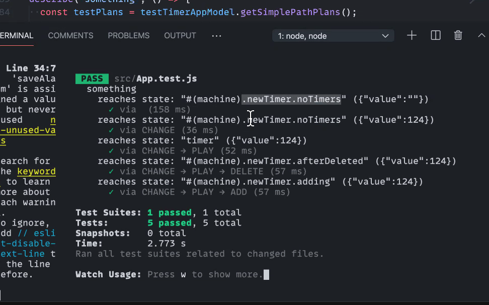

# Frontend Masters React State Modeling Workshop

### NOTES:
## Model-based Testing with XState
- don't need to use xstate for the code
- can only use xstate for the testing part
- describe app behavior as a state machine
- src/app.test.js
  - testing machine from User's point-of-view
  - user only sees the outcome, not the internal states AKA complexity
    - i.e. the patron only sees the food coming, not the complexities of the food being ordered, prepared, checked, delivered, etc.
  - 
- `import { createModel } from '@xstate/test';`
- with `@testing-library/react`;
- Where are the actual tests?
- tests are generated automagically
  - `getSimplePathPlans()` finds all the state combos and tests the conditions
  - not the shortest
  - simple path does not repeat states
- the more states you add, the more tests it automagically creates
  - may have to add substates explicitly to make sure those get tested as well
- `yarn test`

## Tip
- use `react-query` package to not over-fetch
  - when react mounts/unmounts component; prevent it from over-fetching
- things not to do inside state-machines:
  - non-deterministic stuff (unpredictable)
  - everything is strictly declarative in xstate
  - everything is predictable / deterministic / no free will ????!!!
    - **can predict the future~!~!~! >_<**
  - don't do side effects inside of an action
  - don't mutate context inside an assign()
- xstate large bundle size - bundlephobia 16.4kbs gzipped
  - NOTE: xstate will save space overall by simplifying app logic
  - xstate 5 will be more modular so that things can be imported individually more easily
  - xstate fsm - is minimalistic - only 1 kb
 
 
 

*Forked from here*: https://github.com/davidkpiano/frontend-masters-react-workshop

 
 
 

Welcome to the [Frontend Masters React + XState workshop!](https://frontendmasters.com/workshops/xstate-react/)

## XState

- GitHub repo: https://github.com/davidkpiano/xstate
- Documentation: http://xstate.js.org/docs
- Visualizer: http://xstate.js.org/viz

## Getting Started

To run this workshop:

- Clone this repo
- Run `yarn install`
- Run `yarn start`
- Navigate to [http://localhost:3000/00](http://localhost:3000/00) to get to the first exercise.

## Exercises

Exercises are separated by directory in `src/##`. Each directory will contain a `README.md` describing the goal of the exercise, as well as tips and comments in the `Timer.js` and `timerMachine.js` files.

Your objective is to accomplish the goals in `README.md`. If you get stuck, refer to the `Timer.final.js` and/or `timerMachine.final.js` files in each directory.
